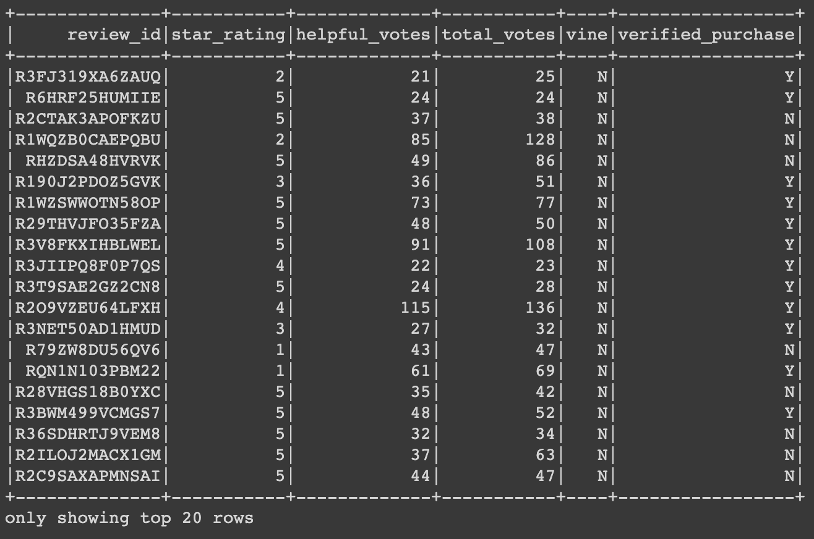
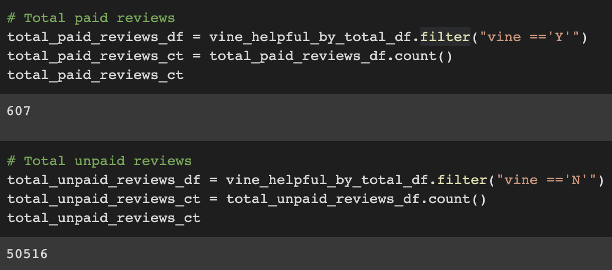
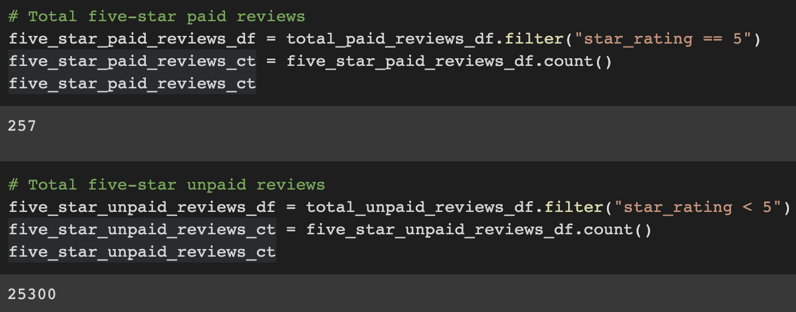
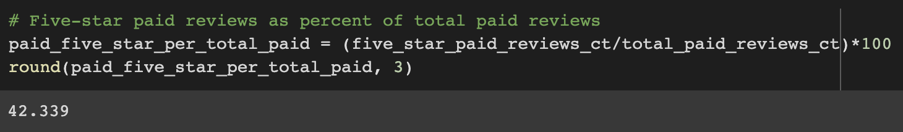
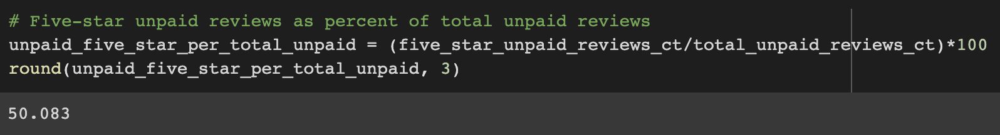

# Amazon_Vine_Analysis
Amazon Vine reviews with AWS, postgresql, PySpark, and Google Colab

## Overview
The overarching purpose of this project was to conduct a meta-analysis of Amazon reviews. Specifically it was to analyze reviews produced as part of the Amazon Vine program, where select members of Amazon's reviewer community are compensated to review sample products. The primary goal of this inquiry is to determine if there is any bias towards favorable reviews from the paid Vine members in the available data.

Out of the 50 datasets of product categories available to chose from, I chose to analyze reviews in the Camera category - high-value, technical products requiring experience and knowledge to effectively review. The initial ETL portion of the project was conducted, as proscribed, using AWS, postgresql, and PySpark in Google Colab. The data analysis segment was conducted using PySpark and Google Colab.

## Results
To begin with, I filtered the available reviews to just those with more than 20 votes, and those which were more than 50% "helpful."

Calculations were made from this filtered dataset. Results were as follows:

* Out of a total of 51,123 reviews in the dataset, 50,516 (98.81%) were unpaid and 607 (1.19%) were paid reviews.

* Out of a total of 25,473 five-star reviews, 25,300 (99.32%) were unpaid, while only 257 (1.01%) were paid.

* Out of 607 total paid/Vine reviews, 257 (42.3%) were 5-star reviews.

* Out of 50,516 unpaid reviews, 25,300 (50.08%) were 5-star reviews.

## Summary
What these numbers seems to suggest is that there is not strong bias **toward** five-star reviews from paid Amazon Vine reviewers. If anything, Vine reviews might show a tendency towards being more critical in their reviews. This conclusion could be further examined by looking at the distribution of all star-levels across paid and unpaid reviews. Also, for a more thorough analysis, this same meta-analysis should be conducted across a few different product catagories.
